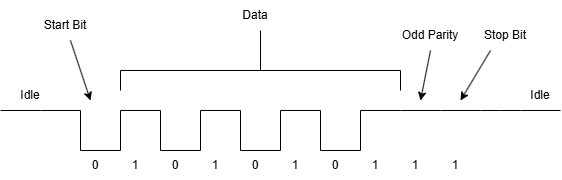
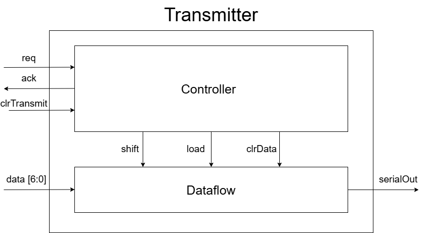
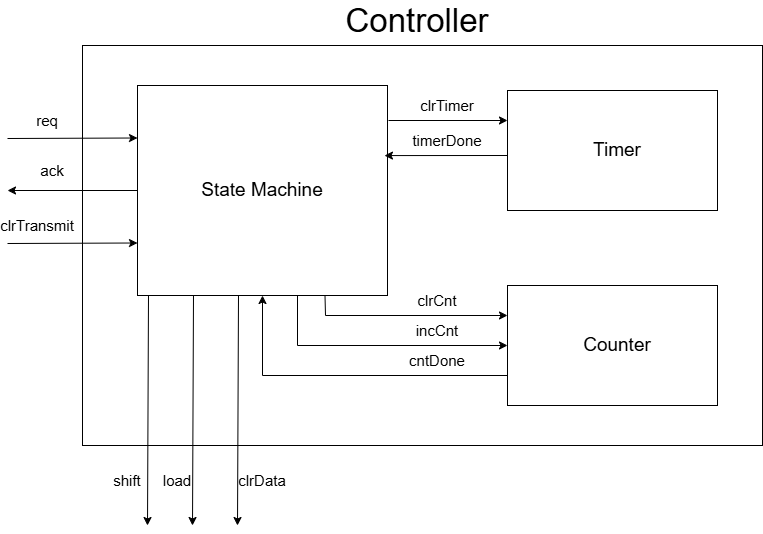
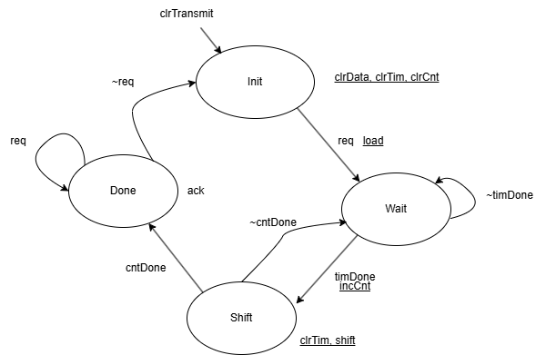

# Custom UART module
## Video Demonstration
https://youtu.be/bmM2D0RvaSs

## Goals
- Learn SystemVerilog
- Learn to program state machines
- Learn specifics of UART communication protocol
- Get working transmitter and reciever implemented on Basys 3 development board
- Make sure timing is precise (not just close enough)

## What is UART
I just want to start by giving an overview of UART so my project can be better understood. If you already know UART you can skip this section. 

Universal Asynchronous Receive Transmit (UART) is a communication protocol. It is a standard for communication so that any devices with UART capabilities can talk to each other. UART devices will have a receive pin for receiving data, and a transmit pin for sending data. One devices transmit pin will be wired to the others receive pin and vice versa. Logic for UART is very straightfoward, high voltages will represent a 1 being sent, and low voltages will represent a 0 being sent. UART usually can be configured to send data in 8 bit or 7 bit chunks. While not sending data, the device idle the line at a high voltage, to signal when a transmission is going to occur it sends a start bit, which is a 0. This lets the receiving device know it is time to listen for data. It will then send the data. It also ends with a 1 as a stop bit. Since the stop bit is the same voltage as idling, the device will keep the line at a high voltage until the next transmission. There is one more optional bit of data. Some devices will have error checking in the form of an odd or even parity bit. Odd parity would send a 0 when the data has an odd number of 1s, and a 1 when the data has an even number of 1s. The effect is that if we exclude the start and stop bits, the total number of 1s in the data being sent will always be odd. If odd parity is set up and a device receives an even number of 1s, we know that the data is corrupted. This won't always happen when data is corrupted, but it can help identify some errors. Even parity is the opposite of odd parity where we set the bit so the data always has an even number of 1s. Some devices will not use a parity bit, and some will use 2 stop bits. I have also seen some devices which support 9 bits of data as well. We also have a baud rate. Each device will need to have the same baud rate. The baud rate is how many bits/sec we will send in a transmission. 

## Design

For my design I chose the parameters below. 
- 7 data bits
- odd parity
- 9600 baud rate

### Top diagram
I have usually found that a top down design approach with a bottom up implementation/coding works the best for me. Because of this I started with a very high level block diagram. 

 This design is fairly straighfoward. This design was copied from Designing Digital Systems With SystemVerilog(v2.0) by Brent E. Nelson, and a lot of the design is heavily inspired by the same book, although I have made my own changes based on personnal preference. I have a seperate modules for both the transmitter and the receiver. Each module communicates with the host (device using the UART) via some sort of handshake. It also has the data we want to send going into the transmitter, which will then be converted to our serial signal, coming out of the serial out. The receiver is fairly similar but it receives data from serial in and sends it to the host. 

 ### Transmitter
I started designing and implementing the transmitter first because I believe it will be the easiest to debug. We can break the transmitter down into a control block and a dataflow. The dataflow knows nothing about the system, it only does with the data what it is told. The controller will be handling all of the logic for actually sending the data. In my design I chose to use shift registers for the dataflow because it made the most intuitive sense to me. We will need the signals to load the input data into the registers, a shift signal to tell the registers when to shift, and a clrData bit for initializing the output with a high voltage. It was also at this point I picked the handshake for the system. The host will assert a 1 on the request line (req) when it is ready to send data. The data must be stable before asserting req. The system will then send the data, and return acknowledge (ack) when the data is finished being sent. The host can then deassert req whenever. When req is deasserted, ack can then be deasserted, letting the host know we are ready to send more data. 
 
 
### Transmitter Controller
The controller I designed has 3 main blocks, a state machine, a timer, and a counter. The state machine will handle the logic of communicating with the host and sending the bits. The timer keeps track of how much time has passed since the start of the current bit, and the counter counts how many bits we have already sent. 

### Transmitter Controller State Machine

Transmitter state machine ended up being slightly different from the one I designed (added a load state to rule out my mealy output being a bug, etc..) but this state machine is the one I used as reference while designing and should give a good idea of how it is intended to work. This project is still a work in progress so I may update with a new diagram showing my current logic when finished. (A message for future me) UPDATE THIS SECTION.

### Design Charts not Included
Because the designs for the dataflow, timer, and counter are fairly simple and straightforward, detailed diagrams were not made or included. 

### Testbench
Testbench code was written to test every module except timer, as I have already used this specific timer in multiple projects. 
