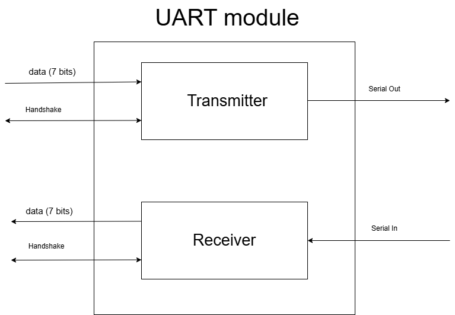

# Custom UART module
## Video Demonstration
https://youtu.be/bmM2D0RvaSs

## Goals
- Learn SystemVerilog
- Learn to program state machines
- Learn specifics of UART communication protocol
- Get working transmitter and reciever implemented on Basys 3 development board
- Make sure timing is precise (not just close enough)

## Design
To start the design we first have to know how UART works. UART is a serial communication protocol. Each device has either a transmitter, a receiver, or both. The direction of data only goes one way on a transmission line. Each device needs its own transmission line to send data. Each device also needs to be set up with the same baud rate, this is because there is no clock line so the receiving device needs to know exactly when to sample the data. Each transmission starts with a start bit, which is just a 0. A UART line idles at a 1, or high voltage. We know data is being sent when the start bit gets sent. We then listen for a specified number of bits. The start bit is followed by the data bits, the information we want to send, starting with the LSB first. We then have an optional parity bit (which can be odd or even). The transmission then ends with the stop bit, which is a 1, or high voltage, and then the line will idle again until the next transmission.

For my design I chose the parameters below. 
- 7 data bits
- odd parity
- 9600 baud rate

I have usually found that a top down design approach with a bottom up implementation works the best for me. Because of this I started with a very high level block diagram. 

